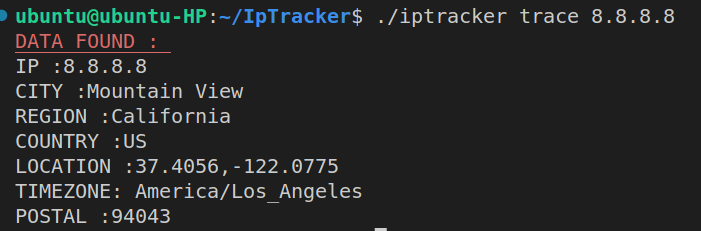
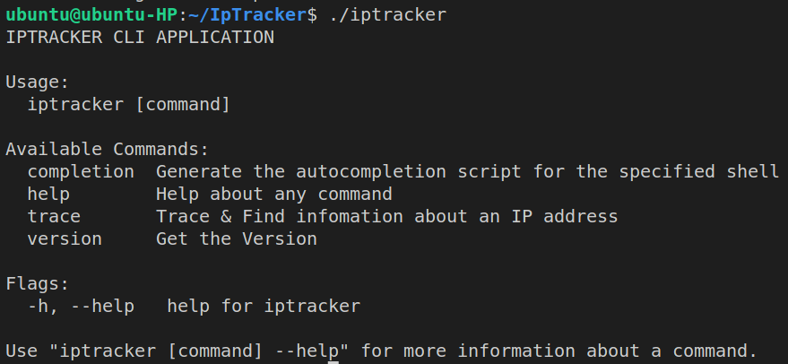

# IP TRACKER 

IP Tracker is a CLI Based application written in Go used to track the ip address and give details about it


## Installation


```bash
    git clone https://github.com/Sayakdutt/IpTracker.git
    cd IpTracker
    go build

```
## Usage

```bash
    ./iptracker trace <ip-address>
```


## Screenshots




## Comlete Guide




